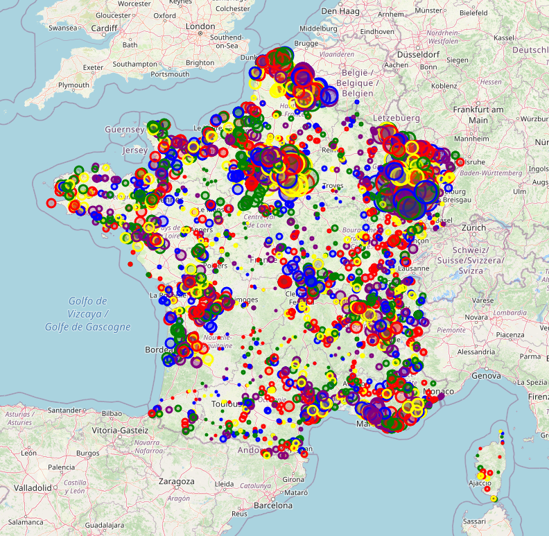
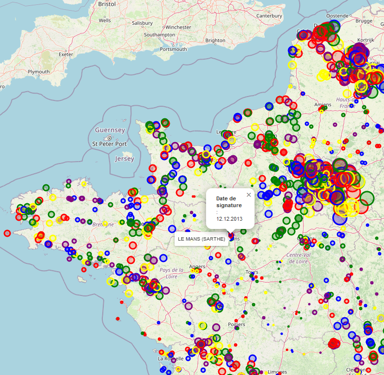

# Real estate sales map

Simple **Python** program that parses a **CSV** file to display geolocation data on a **map**.


---

# Table of Contents

* [About the Project](#about-the-project)
* [Prerequisites](#prerequisites)
* [Usage](#usage)
* [License](#license)

# About the Project

<table>
  <tr>
    <td>
      
    </td>
    <td>
      
    </td>
  </tr>
</table>

This is a simple program asked by a friend of mine, who wanted to display some data on a map for easier visualization.

The purpose is to display a map representing the real estate sales in France according to a provided **CSV** file containing the data.

The CSV file contains the following information :

- ID
- Year of sale
- Country
- Department
- Commune (City)
- Date of signature
- Address
- GPS coordinates (latitude and longitude)

> [!Note]
> The CSV file actually contains values separated by `;`, not by `,`, due to the French version of Excel on Windows

The data will be represented in the map by circle of different colors and sizes, and tooltips will allow to display information like the city or the sale date.

Each year is represented by a circle of different color, and the size of the circle gives an indication on the number of sales :

<table>
  <tr>
    <td>
      
    </td>
    <td>
      
    </td>
  </tr>
</table>

# Prerequisites

You need **Python** to run the script,
I used Python `3.12`, but it should work with a wide range of other versions.

The program uses the **Folium** package, so you also want to install it to be able to run the program :

```bash
python -m pip install folium
```

# Usage

1. Install Folium if not installed :
   ```bash
   python -m pip install folium
   ```
2. Run the program
   ```bash
   python .\program.py
   ```

It should output a file named `carte.html`, simply open this file with your preferred browser and explore the data.

# License

[General Public License (GPL) v3](https://www.gnu.org/licenses/gpl-3.0.en.html)

This program is free software: you can redistribute it and/or modify it under the terms of the GNU
General Public License as published by the Free Software Foundation, either version 3 of the
License, or (at your option) any later version.

This program is distributed in the hope that it will be useful, but WITHOUT ANY WARRANTY; without
even the implied warranty of MERCHANTABILITY or FITNESS FOR A PARTICULAR PURPOSE. See the GNU
General Public License for more details.

You should have received a copy of the GNU General Public License along with this program. If not,
see <http://www.gnu.org/licenses/>.